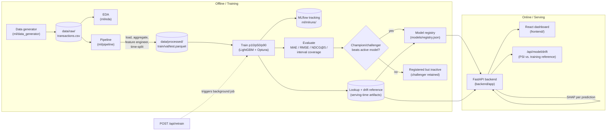
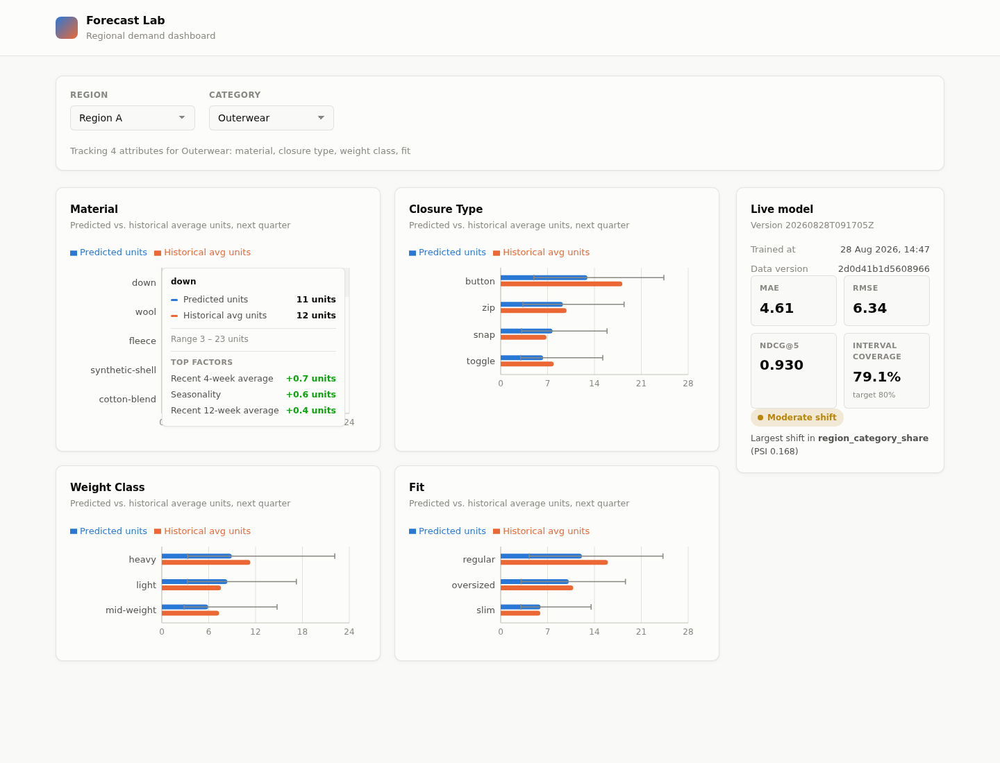

# Forecast Lab

A regional demand-forecasting tool for retail inventory planning. Given a
**region** and a **product category**, it predicts which product
**attributes** (material, fit, closure type, sleeve type, ...) will sell
best next quarter — so regional buyers can stock the right mix instead of
guessing from last year's memory.

> "In Region A, for Outerwear, `fleece` material and `heavy` weight-class
> are trending up — with wool and down close behind."

This is a from-scratch, synthetic-data portfolio project: a clean-room
schema, a deterministic data generator, a full ML lifecycle (EDA → features
→ training → evaluation → registry), a FastAPI serving layer, and a React
dashboard.

## Problem framing

See [docs/problem_framing.md](docs/problem_framing.md) for the full
objective, target variable, and metric justification. In short: the model
predicts weekly `units_sold` per `(region, category, attribute_type,
attribute_value)` and is evaluated on **MAE**, **RMSE**, and **NDCG@5**
(since the product surfaces a top-5 ranked list of attributes, ranking
quality matters as much as point-forecast accuracy).

## Architecture



**Design principle:** training and serving are fully decoupled. The API
never re-runs feature engineering or training inline — it loads a versioned
model + a versioned "lookup artifact" (the most recent historical feature
snapshot per group) from the registry. This is what prevents train/serve
skew: any feature derived from historical aggregates (lags, rolling means,
regional demand share) is computed once, persisted, and reused identically
at inference time.

## Model quality & governance

Beyond a point-estimate forecast, the model produces a full quality story
per prediction and per version:

- **Prediction intervals** — rather than one LightGBM regressor, training
  fits three quantile models (p10/p50/p90). p50 is the headline prediction
  and what MAE/RMSE/NDCG@5 are scored against (a standard, defensible
  substitution — MAE is minimized by the conditional median); p10/p90 give
  the product a `predicted_units_low`/`predicted_units_high` range instead
  of a bare number. Interval calibration is checked automatically
  (`interval_coverage` — the fraction of held-out actuals actually falling
  inside the p10–p90 band, which should sit close to 0.8).
- **Per-prediction explainability** — `GET /api/predictions` includes
  `top_factors` per attribute value: the top SHAP contributions (feature,
  value, signed impact in units of `units_sold`) from `shap.TreeExplainer`
  against the p50 model, computed on demand at serving time
  (`ml/pipeline/explainability.py`). This answers "why is this attribute
  predicted to trend up" with a real per-prediction breakdown, not just a
  global feature-importance chart.
- **Champion/challenger promotion** — every training run registers its
  model as a *challenger* and only promotes it to *active* if it beats the
  current champion on held-out test MAE (`ml/pipeline/registry.py`,
  `ModelRegistry.promote_if_better`). A retrain that regresses quality never
  silently replaces a better model already in production; a losing
  challenger stays registered (visible via the version history) but never
  serves traffic. `POST /api/retrain`'s job result reports `promoted` and
  `promotion_reason` so this decision is visible through the API, not just
  in logs.
- **Drift monitoring** — `GET /api/model/drift` computes the Population
  Stability Index (the standard industry metric for this) between each
  monitored feature's training-time distribution and its most recent known
  values (`ml/pipeline/drift.py`), flagging `stable` / `moderate_shift` /
  `significant_shift` and whether a retrain is recommended — independent of
  whether ground-truth labels for the recent period exist yet, which is
  exactly when this kind of signal is most useful.

## Repository layout

```
ml/
  config/          # config.yaml (paths, cutoffs, hyperparameters) + domain taxonomy
  data_generator/  # deterministic synthetic data generator
  eda/             # EDA script -> docs/eda/ (stats + plots)
  pipeline/        # data loading, splitting, features, training, evaluation,
                    # registry (champion/challenger), drift (PSI), explainability (SHAP)
  tests/           # pytest unit tests + training smoke test
backend/
  app/
    api/           # FastAPI routes
    core/          # settings
    schemas/       # pydantic request/response models
    services/      # model serving + retraining orchestration
  tests/           # FastAPI TestClient tests
frontend/
  src/
    api/           # typed fetch client
    components/    # dashboard UI components
    pages/         # Dashboard page
    types/         # API/domain TypeScript types
docs/
  problem_framing.md
  eda/             # generated EDA artifacts (stats json + plots)
  screenshots/     # dashboard screenshots
```

## Data

Synthetic order-line data — no real company, brand, city, or person
appears anywhere. Schema:

| column                     | meaning                                            |
|----------------------------|-----------------------------------------------------|
| `order_id`                 | unique order line id                                |
| `order_date`               | date of the order line                              |
| `region_code`              | `"Region A"` .. `"Region F"`                        |
| `product_category`         | `Outerwear`, `Footwear`, `Tops`, `Bottoms`, `Accessories` |
| `product_attribute_type`   | e.g. `material`, `closure_type`, `fit`, `sleeve_type` |
| `product_attribute_value`  | e.g. `wool`, `zip`, `slim`                          |
| `quantity`                 | units sold on this order line                       |
| `unit_price`               | price per unit                                      |

The generator ([ml/data_generator/generate.py](ml/data_generator/generate.py))
injects real structure so the ML stage has signal to find:

- **Seasonality** — e.g. Outerwear peaks in Dec/Jan, Tops peak in Jul/Aug,
  scaled by each region's climate profile.
- **Regional preference skew** — e.g. cold regions favor `wool`/`heavy`
  attributes; every attribute value also gets a smaller, stable per-region
  affinity so no two regions look identical.
- **A slow multi-year trend** per category.
- Poisson noise on top, so the signal is real but not noiseless.

It's fully deterministic (fixed seed) — `python -m ml.data_generator.generate`
regenerates byte-identical output.

## Quickstart (local, no Docker)

```bash
python3 -m venv .venv && source .venv/bin/activate
pip install -r requirements.txt

# 1. Generate synthetic data (deterministic, ~80k rows, 2 years)
python -m ml.data_generator.generate

# 2. Run EDA (writes docs/eda/*.json and *.png)
python -m ml.eda.run_eda

# 3. Run the full training pipeline (feature engineering, HPO+CV, eval, registry)
python -m ml.pipeline.run_training

# 4. Run tests
pytest ml/tests backend/tests -v

# 5. Start the API
uvicorn backend.app.main:app --reload
# -> docs at http://localhost:8000/docs
```

```bash
cd frontend
npm install
cp .env.example .env   # VITE_API_BASE_URL=http://localhost:8000
npm run dev
# -> http://localhost:5173
```

## One-command demo (Docker)

```bash
docker compose up --build
```

This builds and starts both services. The backend container generates the
synthetic dataset and trains a model on first boot if none exists yet
(`backend/entrypoint.sh`), then serves on `:8000`; the frontend serves on
`:5173`.

## Screenshots

Region A / Outerwear — each bar's whisker is the p10–p90 prediction interval,
and the sidebar shows live model metrics plus a drift status badge:


Switching to Region E / Tops re-fetches attribute types and predictions
(note the wider intervals here — the model is genuinely less certain about
some Tops attributes in this region, and shows that honestly rather than
hiding it):


Hovering a bar reveals its SHAP-based explanation — the specific factors
that pushed this attribute's prediction up or down:



## ML lifecycle details

- **Splitting**: strictly time-based (`ml/pipeline/splitting.py`) — train
  through 2024-06-30, validation through 2024-09-30, test after. No
  shuffling, no leakage across the boundary.
- **Features**: calendar features, lags (1/4/52 weeks), rolling
  mean/std, trailing price, trend slope, and each attribute value's trailing
  share of its parent group's demand — all computed with `shift(1)` before
  any window operation, so no feature ever sees its own label
  (`ml/pipeline/features.py`, verified by `ml/tests/test_features.py`).
- **Training**: LightGBM + Optuna hyperparameter search (searched once on a
  plain regression objective), then p10/p50/p90 quantile models fit with
  the winning tree-structure hyperparameters, scored via expanding-window
  `TimeSeriesSplit` cross-validation on the training set only
  (`ml/pipeline/training.py`).
- **Tracking**: every run's params/metrics/all three quantile models are
  logged to MLflow (`ml/mlruns/`, local file-based tracking store).
- **Registry**: trained models are saved as versioned artifacts
  (`models/model_<version>.joblib` + `models/lookup_<version>.joblib`),
  indexed in `models/registry.json` with metrics/params/training date. Only
  the last N versions are kept, and the active version is never pruned
  regardless of age. New versions are promoted to active only if they beat
  the current champion (`ml/pipeline/registry.py`).
- **Evaluation**: MAE, RMSE, and NDCG@5 (scored against p50) plus prediction
  interval coverage (p10–p90 calibration), computed on the held-out test set
  (`ml/pipeline/evaluation.py`) — see
  [docs/problem_framing.md](docs/problem_framing.md) for why these three.
- **Explainability**: SHAP TreeExplainer values computed on demand at
  serving time for the p50 model, returned per prediction
  (`ml/pipeline/explainability.py`).
- **Drift monitoring**: Population Stability Index between the training-set
  reference distribution (persisted alongside the lookup artifact) and the
  latest known feature values, exposed via `GET /api/model/drift`
  (`ml/pipeline/drift.py`).

## Testing & CI

- `ml/tests/` — unit tests for data loading, feature engineering (including
  explicit no-leakage checks), splitting, evaluation metrics, champion/
  challenger promotion logic, drift PSI calculations, SHAP contribution
  shape/ranking, and a training smoke test that fits real (tiny) p10/p50/p90
  quantile models end-to-end and round-trips them through `joblib`.
- `backend/tests/` — FastAPI `TestClient` tests covering all endpoints
  (including `/api/model/drift`), prediction interval/SHAP field shape,
  validation errors, and 404s.
- `.github/workflows/ci.yml` runs `ruff` lint, the full pytest suite (with a
  fast CI-only training config, `ml/config/config.ci.yaml`, so a real model
  exists for the backend tests), and a separate frontend job (typecheck,
  lint, build).

## Configuration

All paths, date cutoffs, and pipeline parameters live in
[ml/config/config.yaml](ml/config/config.yaml) — nothing is hardcoded across
the individual pipeline modules. The domain taxonomy (regions, categories,
attribute types/values) lives in
[ml/config/taxonomy.py](ml/config/taxonomy.py) and is the single source of
truth shared by the data generator, feature pipeline, and API.
